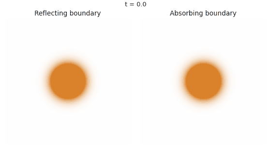
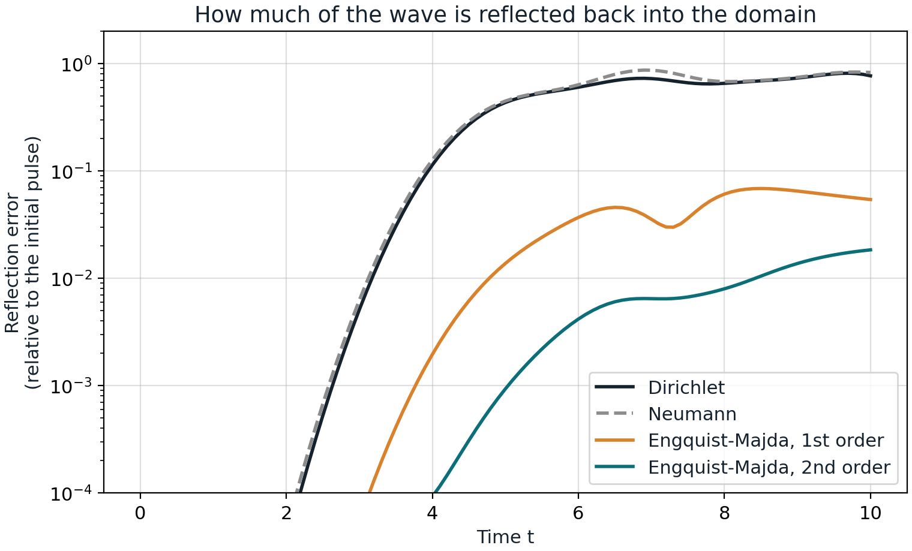
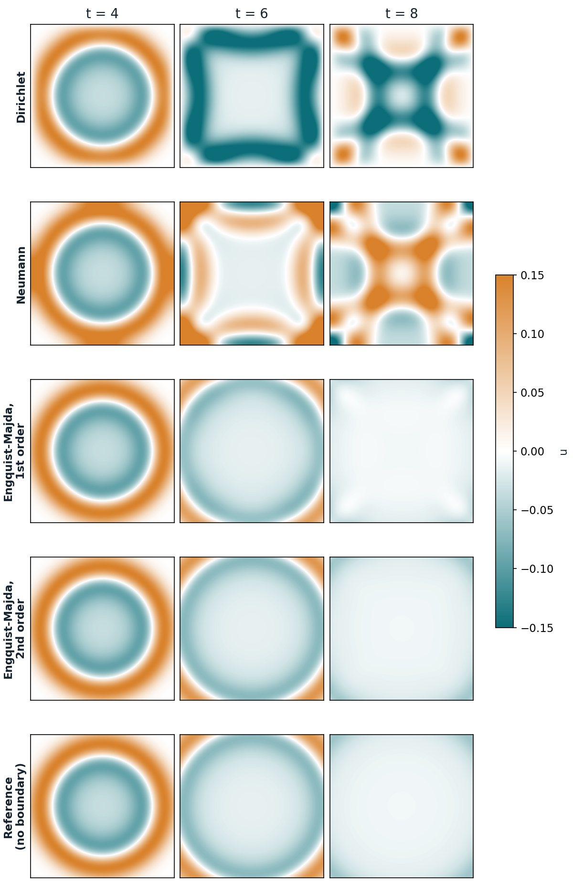

# Absorbing boundary conditions for the wave equation

When we simulate waves on a computer, the domain has to end somewhere. If the
edge of the domain behaves like a wall, waves bounce off it and pollute the
solution. **Absorbing boundary conditions** let waves leave the domain as if
it continued forever.

This project compares two reflecting boundary conditions (Dirichlet and
Neumann) with the first- and second-order absorbing conditions of Engquist and
Majda, for the 2D wave equation solved with finite differences in Python.



*Left: the walls reflect the wave back into the domain. Right: with the
second-order absorbing condition, the wave leaves the domain.*

## Background

This was a project in the course *Partial Differential Equations and the Finite
Element Method* at Karlstad University, Sweden (report dated 12 January 2024).
During my practical placement I had introduced an artificial boundary in a
model, and the examiner, [Prof. Eddie Wadbro](https://www.kau.se/en/employees/eddie-wadbro), 
proposed this project on how to handle such boundaries without artificial reflections.

The original 2024 work is kept in [`original-2024/`](original-2024). This
repository adds a revised 2026 version in [`modified-2026/`](modified-2026);
see [What changed since 2024](#what-changed-since-2024).

## The problem

We solve the wave equation with wave speed 1,

$$u_{tt} = u_{xx} + u_{yy}, \qquad (x, y) \in [0, 10]^2,\ 0 \le t \le 10,$$

starting from a Gaussian pulse at rest in the middle of the square:

$$u(x, y, 0) = e^{-\left((x-5)^2 + (y-5)^2\right)}, \qquad u_t(x, y, 0) = 0.$$

The pulse spreads out as a ring and reaches the edges at about $t = 4$.
The same boundary condition is used on all four edges. Written for the left
edge $x = 0$:

| Boundary condition | Equation at $x = 0$ | Behaviour |
|---|---|---|
| Dirichlet | $u = 0$ | Reflects the wave, with a sign change |
| Neumann | $u_x = 0$ | Reflects the wave, same sign |
| Engquist–Majda, 1st order | $u_t - u_x = 0$ | Absorbs waves that hit the edge head-on |
| Engquist–Majda, 2nd order | $u_{xt} - u_{tt} + \tfrac12 u_{yy} = 0$ | Also absorbs waves that hit the edge at an angle |

## Method

- **Interior:** the standard leapfrog scheme, second order in space and time,
  on a grid with spacing $h = 0.05$ and time step $\Delta t = 0.5\,h$
  (Courant number 0.5, below the stability limit $1/\sqrt{2}$).
- **Absorbing edges:** the discretisations of Mur (1981). The second-order
  condition is used along each edge and the first-order condition at the
  corners.
- **Measuring reflections:** a reference solution is computed with the same
  scheme on a much larger square, so that no reflection can reach the window
  $[0, 10]^2$ before $t = 10$. Inside the window, the difference between a
  solution and the reference is caused by the boundary alone. The
  *reflection error* is the size of this difference (2-norm over the window)
  relative to the initial pulse.

## Results

| Boundary condition | Largest reflection error |
|---|---|
| Dirichlet | 81 % |
| Neumann | 87 % |
| Engquist–Majda, 1st order | 6.9 % |
| Engquist–Majda, 2nd order | **1.8 %** |



Both reflecting conditions send almost the whole wave back into the domain.
The first-order absorbing condition reduces the reflection by more than a
factor of 10, and the second-order condition by a factor of about 45. The
second-order condition is better because it also absorbs the parts of the
wave that hit the edges at an angle, which are largest near the corners.



The snapshots show the same story: at $t = 8$ the reflecting boundaries fill
the square with reflected waves, while the second-order absorbing solution is
almost identical to the reference.

## What changed since 2024

The original 2024 scripts are kept unchanged in
[`original-2024/`](original-2024).
Running [`reproduce_report_figures.py`](original-2024/reproduce_report_figures.py)
recreates Figures 1–8 of the report from them
([result](original-2024/report-figures-1-8.png)).

The 2026 version changes the following:

1. **Boundary conditions on all four edges.** In 2024, only the edge $x = 0$
   was given a boundary condition. The other three edges were never updated,
   so they acted as Dirichlet walls in both runs.
2. **The absorbing conditions are implemented and tested.** The report
   derived the Engquist–Majda conditions, but the 2024 code only simulated
   Dirichlet and Neumann boundaries. The claim that the second-order condition
   absorbs better is now confirmed with numbers.
3. **More accurate and faster.** A finer grid ($h = 0.05$ instead of 0.1), a
   second-order accurate first time step, and NumPy array operations instead
   of Python loops. Only three time levels are kept in memory instead of all
   1001.
4. **Correct orientation of the plots.** In the report's figures,
   `plt.imshow` drew the first array index ($x$) downwards, so the edge
   $x = 0$ appears at the top of each picture. The 2026 figures have $x$ to
   the right and $y$ upwards.

Note: despite the course title, both versions use the **finite difference
method**, not finite elements.

## Repository structure

```
absorbing-boundary-conditions/
├── README.md
├── LICENSE
├── requirements.txt
├── figures/                         figures used in this README
├── modified-2026/
│   ├── wave.py                      solver and boundary conditions
│   ├── compare.py                   runs all conditions and the reference
│   ├── figures.py                   figures and animation
│   └── run_all.py                   runs everything
└── original-2024/
    ├── report-2024.pdf              the original report
    ├── wave_dirichlet.py            original code, Dirichlet at x = 0
    ├── wave_neumann.py              original code, Neumann at x = 0
    ├── reproduce_report_figures.py  recreates the report's Figures 1–8
    └── report-figures-1-8.png
```

## How to run

You need Python 3 with NumPy, Matplotlib and Pillow.

```bash
pip install -r requirements.txt
python modified-2026/run_all.py
```

This takes less than a minute and writes the figures to `figures/`.

## References

1. B. Engquist and A. Majda, "Absorbing boundary conditions for the numerical
   simulation of waves", *Proceedings of the National Academy of Sciences*
   74(5), 1765–1766, 1977.
2. B. Engquist and A. Majda, "Absorbing boundary conditions for the numerical
   simulation of waves", *Mathematics of Computation* 31(139), 629–651, 1977.
3. G. Mur, "Absorbing boundary conditions for the finite-difference
   approximation of the time-domain electromagnetic-field equations",
   *IEEE Transactions on Electromagnetic Compatibility* EMC-23(4), 377–382, 1981.

## Author

Samuel Agenorwoth, doctoral researcher in Computational Engineering at LUT
University, Finland. [samuelagenorwoth.com](https://samuelagenorwoth.com)

Licensed under the [MIT License](LICENSE).
